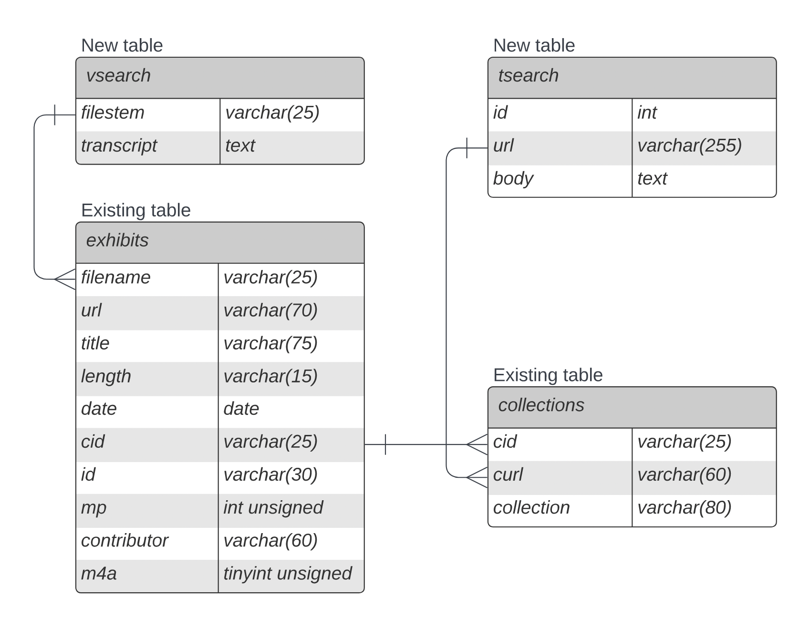

<div align="center">
  
  <h3>Developer's guide</h3>
  <h4>Team Cloud Prime</h4>
  Zed Chance<br>
  Victor Galbraith<br>
  Nick Fairneny<br>
  Emmanuel Castrejon<br>
  Kobe Charles<br>
  Cesar Arroyo<br>
</div>

### Table of Contents

- [Introduction](#introduction)
- [Implementation Tools and Technologies](#implementation-tools-and-technologies)
- [The `dev1` machine](#the-dev1-machine)
  - [Where the site lives](#where-the-site-lives)
  - [Setting up your own development branch](#setting-up-your-own-development-branch)
  - [Making changes to the site](#making-changes-to-the-site)
    - [Cleaning up branches](#cleaning-up-branches)
  - [MySQL databases](#mysql-databases)
- [Embedded Player](#embedded-player)
  - [How to view the player](#how-to-view-the-player)
  - [Starting the player page at a different location](#starting-the-player-page-at-a-different-location)
  - [How the player is implemented](#how-the-player-is-implemented)
    - [Function description](#function-description)
  - [How to debug the player](#how-to-debug-the-player)
  - [Where to add functionality to the player](#where-to-add-functionality-to-the-player)
- [Advanced Search](#advanced-search)
  - [Bootstrapping the MySQL database on a new machine](#bootstrapping-the-mysql-database-on-a-new-machine)
    - [Add the `FULLTEXT` index to the existing exhibits table](#add-the-fulltext-index-to-the-existing-exhibits-table)
    - [Create the `tsearch` table](#create-the-tsearch-table)
    - [Creating the `vsearch` table](#creating-the-vsearch-table)
  - [The `search.php` file](#the-searchphp-file)
  - [Description of database schema](#description-of-database-schema)
  - [How we generated the `tsearch` database table](#how-we-generated-the-tsearch-database-table)
    - [To create the `tsearch` table](#to-create-the-tsearch-table)
    - [To scrape a page](#to-scrape-a-page)
    - [To scrape multiple pages](#to-scrape-multiple-pages)
    - [Running a query](#running-a-query)
  - [How we generated the `vsearch` database table](#how-we-generated-the-vsearch-database-table)
    - [How it works](#how-it-works)
    - [Set up your Google Cloud project](#set-up-your-google-cloud-project)
    - [How to use](#how-to-use)
    - [Transcribe in batches](#transcribe-in-batches)
    - [Troubleshooting](#troubleshooting)
  - [How we allow for full-text search](#how-we-allow-for-full-text-search)
  - [The query that the advanced search performs](#the-query-that-the-advanced-search-performs)
- [Appendices](#appendices)
  - [Debugging](#debugging)
    - [Tips for debugging JavaScript](#tips-for-debugging-javascript)
    - [Tips for debugging the web server](#tips-for-debugging-the-web-server)
    - [How to check the status of the web server](#how-to-check-the-status-of-the-web-server)
  - [Software requirements](#software-requirements)
    - [Minimum browser requirements for embedded audio player](#minimum-browser-requirements-for-embedded-audio-player)
  - [Resources](#resources)
    - [Additional resources for `vsearch`](#additional-resources-for-vsearch)

## Introduction

ReelRadio is a site dedicated to hosting radio “airchecks” from the 50s - 90s.
The site’s main features are the ability to stream these audio recordings, and comment on them.
he site has the ability to search through the various collections and exhibits.

This document will go into detail on how our team, Cloud Prime, was able to implement both the embedded audio player and the advanced search.
Implementation details, as well as how to debug, will be included.

## Implementation Tools and Technologies

The site uses a very common LAMP stack, that is: 
- Linux (operating system)
- Apache (web server)
- MySQL (database)
- PHP (text preprocessor)

To experiment with other web server features, we also use nginx on the dev1 machine.

Other technologies include: 
- JavaScript (embedded audio player)
    - [jQuery](https://github.com/jquery/jquery)
    - [Plyr.js](https://github.com/sampotts/plyr)
    - [moment.js](https://github.com/moment/moment/)
- Python (audio transcription helper)
- Shell scripts (text scraper)
- Selenium (automated browser testing)

The production machine that hosts the site is rented from [Linode](https://www.linode.com/), as well as the development machine (named `dev1`, details follow).
The development machine is a lesser powered but otherwise identical build to the production machine. 

The site is version controlled with git, with remote repositories on GitHub.
The actual site code repository is private, for client request, however some of the tools we used to implement our features are public (viewable [here](https://github.com/reelradio)).

## The `dev1` machine

The `dev1` machine was set up to alleviate the need for each team member to have to set up and locally host the site to work on it.
Each team member simply `ssh`'d into the machine and did their work there.
This section will describe how we were able to work on the site simultaneously and independently.

The rest of this document assumes that you have access to the development machine. If your username is `foo` then login to the machine using

```
ssh foo@dev1.reelradio.com
```

and enter your password. 

### Where the site lives

The web server, Apache, serves files in the `/export/dev` directory using a hostname wildcard.
So, any folder inside the `/export/dev` directory, for example `/export/dev/foo`, will be served at `foo.dev.reelradio.com`.
This enables us to each clone a copy of the site repository, and work independently on the site, all in a fully live and deployed testing environment. 

### Setting up your own development branch

To start setup on your own copy of the site, first clone the site repository into `/export/dev` with a new name:

```
cd /export/dev
git clone git@github.com:reelradio/site.git foo
```

This clones the repository into `/export/dev/foo` (this repository is private, so **access to the ReelRadio organization on GitHub is required**).
Next, change to that directory and view the included `README.md` for exact details on how to get the site’s dependencies installed.
For brevity, the following is needed: 

Install the PHP dependencies using [composer](https://github.com/composer/composer):

```
composer install
```

This uses the `composer.json` and `composer.lock` file to create a `vendor` directory.

The site’s secrets are not checked into version control, so make a copy of the secrets file using the example file:

```
cp .env.example .env
```

and fill out the newly created `.env` file with the necessary secrets. Get these secrets from another team member (or check if they have the file already created in their directory). 

The site repository is now set up, and the Apache web server will serve these files at `foo.dev.reelradio.com`, so if for example you are working on a file called `bar.html`, you can see the changes live at `foo.dev.reelradio.com/bar.html` in your browser.

> Note: See [tips for debugging the web server](#tips-for-debugging-the-web-server) and [how to check the status of the web server](#how-to-check-the-status-of-the-web-server) in appendix.

### Making changes to the site

If a developer is working in the `/export/dev/foo` directory on a new feature in a file called `bar.html`, then the developer can view the changes live at the URL `foo.dev.reelradio.com/bar.html` in their browser. This allows the developer to test their features before committing changes. 
`git` is used to version control the site.
The site’s `main` branch is considered stable, and should not be directly pushed to.
Instead, once ready to commit changes, create a new branch:

```
git checkout -b new_feature
```

Then stage, and commit the files

```
git add bar.html
git commit
```

Make sure to use a descriptive commit message, including task number if applicable.
Continue to work on the new feature in this new branch until complete, then open a pull request on GitHub (be sure to correctly choose the base of this pull request to be where you want your code to be merged, be it `main` or an intermediate branch).
Describe what the new feature does and if you ran into any problems in the body of this pull request.
Team members can comment and review the code, and changes can be made by pushing to this branch.
When the code is ready, the pull request can be merged, and the remote branch can be safely deleted. 

When returning to your site repository to make new changes, make sure to check out main and pull before starting development:

```
git checkout main
git pull
```

#### Cleaning up branches

A useful command for cleaning up branches that have been remoted in the remote is:

```
git fetch --prune
```

### MySQL databases
We use MySQL as our database management system. The `dev1` machine has a database that has an identical schema to the production machine, with a subset of tuples, called `zeddev`.
This database is accessible with MySQL’s command line interface:

```
mysql -u foo -p zeddev
```

where `foo` is the username. You will be prompted for the password to the `zeddev` database, get this password from a team member. 

View the available tables with:

```
show tables;
```

And describe each table with

```
describe table_name;
```

Otherwise, use SQL to query the database. A detailed description of the table schema can be found in the [Advanced Search](#advanced-search) section. 

## Embedded Player

When our team started this project, the site used VLC player to play the radio exhibits. So, a `rtsp` link would start VLC player when a user clicked on an exhibit. The site comprises hundreds of collections, each with many exhibits. Each of these pages have links to start the radio exhibit. Because there are thousands of these links, we did not want to have to rewrite the entirety of them. This also allows us to preserve the old functionality, in case a user wants to opt out of the new player.

So to implement our embedded audio player, we essentially layer it on top of the old site inside an `iframe`, seen below.

<div align="center">

</div>

While the user "browses" the site, the actual page never changes. Instead, the `iframe` loads the new page. When the user visits a page that contains the links to play exhibits, we use JavaScript to remove the anchor’s `href`, and add a function to the `onclick` event. This function requests the source URL for the exhibit and attaches it to the audio player, and starts the playback.

### How to view the player
If a developer is working in the directory `/export/dev/foo`, then view the player at the URL `foo.dev.reelradio.com/ram/embedded_player.html` in your browser.
Upon load, the player will be hidden.
Navigate to an exhibit and click play to start an exhibit.
The player is revealed, loaded, and begins playing automatically. 

> Note: See [minimum browser requirements](#software-requirements) in appendix.

### Starting the player page at a different location

By default, the `iframe` loads the home page when visiting `ram/embedded_player.html`.
To start the page off at a different location, say `collections.html`, use the `p` parameter at the end of the URL, for example: 
```
foo.dev.reelradio.com/ram/embedded_player.html?p=/collections.html
```

### How the player is implemented

The player is implemented at the file `ram/embedded_player.html`, in the site repository. We located the file in the `ram` directory because historically this is where all of the scripts to play the exhibits go.

The general layout of this file is as follows:
- CSS styling
- JavaScript code
    - Functions
    - `$(document).ready(...)` section, this code runs when the page is fully loaded
        - `$("#reel-content").on('load', ...)` this code runs when the `iframe` loads a new page
- HTML body, this is where the `iframe` and HTML audio player are

#### Function description

The main JavaScript functions used by the player are as follows:
- `makeRequest`, this function requests a URL from the streaming engine using the file `mediaRequest.php`
    - If successful the return will be the URL and exhibit title as JSON. If not successful an error code will be returned (`401` for not logged in, `400` for bad exhibit name)
- `prepareMedia`, this function attaches the exhibit source URL, title, and start time to the player. This function also shows the player if hidden, so the player appears on first play.
- `playMedia`, this function starts the audio player.
- `rewriteUrl`, this function takes in a pattern and an object. The function gets all anchors in the `iframe` whose `href` matches the pattern and does the following:
    - Extract the exhibit name and start time from the anchor’s `href`
    - Replace the `href` with `javascript:void(0)` so the link simply does nothing when clicked
    - Add a function to the `onclick` event of the anchor, that calls `makeRequest` with the exhibit title, and the timestamp in seconds
- `timestampToSeconds`, this function takes in a timestamp from the exhibit links, and converts it to seconds using moment.js
- `setNowPlayingTitle`, this gets the audio element and sets the now playing text to the exhibit’s title
- `$(document).ready`, this can be thought of as the main entrypoint of all of the JavaScript code. This function runs when the browser declares that the page is ready. A new Plyr.js player is set up here. 
    - `$('#reel-content').on('load', ...)`, the `iframe` that loads the site is identified as `reel-content`, so this function runs each time the `iframe` loads a new page. 
    - This function calls `rewriteUrl` on a few different known patterns, and also sets the title of the page as well as the browser’s URL bar to the current respective values from the page in the `iframe`. This gives the user the illusion that they are browsing between pages when in fact they are never leaving `ram/embedded_player.html`. 
    - In addition, the player normally sits directly on top of the `iframe` on the z-axis via CSS, when the page is scrolled down to the bottom we add margin to the bottom of the `iframe` in order for the player to move below the `iframe` on the y-axis. This allows the users to see all of the content at the very bottom of the current page. 
- `player.on('loadeddata', ...)`, this function runs when the audio player has fully loaded all data and sets the `isLoaded` flag to true. 
- `player.on('play', ...)`, this function runs when resuming from being paused. It checks to see if the player is already loaded, and if so it recalls `makeRequest` with the current exhibit and play time.
- `player.on('ended', ...)`, this function runs when the player’s content ends, and sets the `isLoaded` flag to false. 

The last 3 player functions described in the list above allow the user to play an exhibit, pause and leave for a while, then return and resume. The URL returned by the streaming engine is only valid for the duration of the exhibit plus some padding time, so by re-requesting the URL the user is able to continue playback.

### How to debug the player

One simple way to see that something in the player is going wrong is if the URL bar is never rewritten from the original `ram/embedded_player.html` link. So, if this is happening you can be sure that the code to rewrite the URL bar is never being reached. Check your browser’s JavaScript console for any errors. If you need to check the logs of the web server see the [Tips for debugging the web server](#tips-for-debugging-the-web-server) section. 

> Note: See [tips for debugging JavaScript](#tips-for-debugging-javascript) in the appendix.

### Where to add functionality to the player

The last 3 functions described in the list of Function description are specific to the Plyr.js object, called `player`. So, if looking to add functionality on these specific events, this is where it should go. Otherwise, follow the flow of code starting in `$(document).ready()`, as this acts as our main entrypoint for the script. 

View the [Plyr.js README](https://github.com/sampotts/plyr#readme) for a comprehensive look at the API available. 

## Advanced Search

The site contains hundreds of collections, each with a biography of a radio DJ. Each exhibit has a short description of the radio broadcast. We wanted the users to be able to search all of this information, so we created a program to scrape the text from the site and dump it into a searchable database.

### Bootstrapping the MySQL database on a new machine

These steps need to be followed in order to set up the databases for the advanced search feature. More detailed descriptions of how these tables were created are in the following sections, but to get the feature up and running follow these steps:

#### Add the `FULLTEXT` index to the existing exhibits table

In order to sort the results of the exhibit title query by relevance, a `FULLTEXT` needs to be added to the existing exhibits table. To do that, run this command in MySQL:

```
ALTER TABLE exhibits ADD FULLTEXT(title);
```

#### Create the `tsearch` table

To create the tsearch database, clone the [reelradio/text-search](https://github.com/reelradio/text-search) repo onto your new machine:

```
git clone git@github.com:reelradio/text-search.git
```

Run the `create_tsearch.sql` file to create the table, and the `insert_tsearch.sql` to populate it in MySQL:

```
\. create_tsearch.sql
\. insert_tsearch.sql
```

#### Creating the `vsearch` table

To create the vsearch table, clone the [reelradio/transcribe](https://github.com/reelradio/transcribe) repo onto your new machine:

```
git clone git@github.com:reelradio/transcribe.git
```

Run the `vsearch.sql` file in MySQL to create the vsearch table and populate:

```
\. vsearch.sql
```

### The `search.php` file

The `search.php` file is where users are navigated to use our advanced search feature. When a user types in their query and runs a search, a call to `perform_search.php` (where our search query is handled and returned) is made using JavaScript. The results are then displayed to the screen, ordered by relevance.

### Description of database schema

<div align="center">

</div>

We built on top of the existing database, of which there were 2 tables which we tied into; `collections` and `exhibits`.

We created 2 new tables; the `tsearch` table was built from scraping the collections pages for text, and the `vsearch` table was built from processing audio files through a transcription service.

We associated the scraped pages in the `tsearch` table to their collections in the `collections` table, and associated the transcriptions in the `vsearch` table with the exhibits in the `exhibits` table.

This allowed us to search both of the new tables for relevant matches, and return the associated titles, urls, etc.

### How we generated the `tsearch` database table

A [shell script](https://github.com/reelradio/text-search/blob/main/scraper) was used to scrape collections pages and dump the contents into the database.

#### To create the `tsearch` table

The file `create_tsearch.sql` is used to create the table.
In MySQL, run
```
\. create_tsearch.sql
```

to create the table.

#### To scrape a page
Run
```
./scraper url
```

where `url` points to the page you want to add to the table. This inserts a line in the `insert_tsearch.sql` file. Once the `insert_tsearch.sql` file is fully populated, run

```
\. insert_tsearch.sql
```

in MySQL to insert all rows into the `tsearch` table.

#### To scrape multiple pages

```
./file_scraper filename
```

where `filename` is a text file that contains a list of URLs that you want to scrape. Each URL must be separated by a new line.

#### Running a query

The `tsearch` table is set up with a full text index, so instead of using the `LIKE` keyword in MySQL, we can use `MATCH` and `AGAINST`. For example,

```sql
SELECT url
FROM tsearch
WHERE
    MATCH(body)
    AGAINST('query goes here');
```

### How we generated the `vsearch` database table

A [Python script](https://github.com/reelradio/transcribe/blob/master/transcribe.py) was used to process `.m4a` audio files into transcripts to be added to the database and make them searchable. To process more `.m4a` audio files, please follow the directions below.

#### How it works

Uses `ffmpeg` to convert an `.m4a` file into a `.flac` file (single channel, 16000 Hz)

1. Uploads the `.flac` file to a Google Cloud Storage bucket (required by Speech-to-Text for audio files over 60 seconds)
2. Deletes the `.flac` file from the local machine
3. Transcribes the uploaded `.flac` file, saving the transcript as a `.txt` file, while also building a MySQL `INSERT` statement and appending it to the `vsearch.sql` file.
4. Deletes the `.flac` file from the Google Cloud Storage bucket
5. Simply log into the database and run the updated `vsearch.sql` file to add additional transcripts into the database.

#### Set up your Google Cloud project

1. Sign in to [Google Cloud Console](https://console.cloud.google.com/)
2. Go to the project selector page and [create a project](https://console.cloud.google.com/projectselector2/home)
3. Enable the [Speech-to-Text API](https://cloud.google.com/speech-to-text)
4. Create a [service account for your project](https://console.cloud.google.com/projectselector/iam-admin/serviceaccounts/create)

> Note: the account needs to have at least Storage Admin access in order to upload to the bucket on Google Cloud.

5. Create a JSON key for your service account

    Select your service account, navigate to the KEYS tab, and select ADD KEY (Create new key)

    This will download a JSON file to your machine, you'll need to know where this is later.

6. Create a [Google Cloud Storage bucket](https://console.cloud.google.com/storage/browser)

> Note: Do not use a nested bucket.

#### How to use

1. Pull the [reelradio/transcribe](https://github.com/reelradio/transcribe) repository to the same machine as your audio files.
2. Edit [`transcribe.py`](https://github.com/reelradio/transcribe/blob/master/transcribe.py#L30-L32) and set `BUCKET_NAME` to the name of your Google Cloud Storage bucket:

    <div align="center">
    
    </div>

3. Using a linux command line, set your authentication environment variable:

    ```
    export GOOGLE_APPLICATION_CREDENTIALS="KEY_PATH"
    ```
    setting `KEY_PATH` with the path to your JSON key file, for example:

    ```
    export GOOGLE_APPLICATION_CREDENTIALS="/home/user/Downloads/service-account-file.json"
    ```

4. Call `transcribe.py` from the command line with the path to the audio file as an argument:

    ```
    python3 transcribe.py path/to/file_name.m4a
    ```

5. There may be a few installs required:

    ```
    sudo apt install python3-pip
    pip install --upgrade google
    pip install --upgrade google-cloud-storage
    pip install google-cloud-speech
    sudo apt install ffmpeg
    ```

#### Transcribe in batches

If you wish to loop over multiple `.m4a` audio files for processing, a shell script [`vloop.sh`](https://github.com/reelradio/transcribe/blob/master/vloop.sh) was created to facilitate using pattern matching to transcribe batches with a single command.

Edit `vloop.sh` to declare the following:

1. Set the starting pattern

    ```
    starting_pattern="abc"
    ```

    (this will match all `.m4a` files starting with the string `"abc"`)

2. Set the `KEY_PATH` with the path to your JSON file, just as before

    ```
    cred_path="/home/user/Downloads/service-account-file.json"
    ```

3. Set the `FILE_PATH` with the path to your audio files to process

    ```
    FILES="audio/m4a"
    ```

4. Call `vloop.sh` from the command line:

    ```
    ./vloop.sh
    ```

    `vloop.sh` does 2 passes, first transcribing all the scoped exhibits matching your specified starting pattern, then matching the remaining exhibits. Duplicates are avoided by checking the `txt` folder for an existing transcript, scoped or unscoped.

#### Troubleshooting

Google Cloud's Speech-to-Text can be tricky to get set up correctly.
1. If the process fails during audio conversion, make sure the original audio files are in `.m4a` format. Conversion from other formats is not currently supported.
2. If the process fails during upload to your Google Cloud Storage bucket, make sure your service account was granted at least Storage Admin access.
3. If the process fails during transcription, make sure the file path to your JSON key is correctly set and that Google Cloud’s Speech-to-Text API is activated. Wait a few minutes before trying again.

> Note: See appendix for [additional resources on vsearch](#additional-resources-for-vsearch).

### How we allow for full-text search

The `FULLTEXT` index on `vsearch`, `tsearch`
MySQL allows for full-text search by declaring a column in your table as `FULLTEXT`, and works with `CHAR`, `VARCHAR`, or `TEXT` data types, see below:

```sql
CREATE TABLE vsearch(
    filestem VARCHAR(25) NOT NULL,
    transcript TEXT,
    PRIMARY KEY (filestem),
    FULLTEXT (transcript)
);
```

This then allows a query to be made using `MATCH(full-text column name) AGAINST (query)`, as below:

```sql
SELECT
    url,
    title
    MATCH(transcript) AGAINST(query) AS relevance
FROM
    exhibits,
    vsearch
WHERE
    MATCH(transcript) AGAINST(query)
    AND
    filename LIKE CONCAT('%', filestem, '.r%')
;
```

with the added benefit of returning a relevance score, which we then used to prioritize which results are displayed first.

### The query that the advanced search performs

We ended up using a query that combines 3 searches:
1. First, one that uses full-text search to query the `tsearch` table of scraped collections pages
2. Second, another that uses full-text search to query the `vsearch` table of transcriptions
3. Third, one that does a limited keyword search on titles, as the site’s original limited search contained when we took on the project.

We combined these 3 and ordered the results by relevance, making for a much more powerful search feature. See below:

```sql
SELECT
    url,
    MIN(title),
    MIN(result_type)
FROM (

    -- query the tsearch table of scraped collections pages 
    SELECT
        url,
        collection AS title,
        MATCH(body) AGAINST(query) AS relevance,
        ' ' AS result_type
    FROM
        collections,
        tsearch
    WHERE
        MATCH(body) AGAINST(query)
        AND
        curl LIKE CONCAT('%\"', SUBSTRING(url, 2), '%')

    UNION

    -- query the vsearch table of transcriptions
    SELECT
        CONCAT('/', SUBSTRING(url, 10, CHAR_LENGTH(url) - 11)) AS url,
        title,
        MATCH(transcript) AGAINST(query) AS relevance,
        '(transcription result)' AS result_type
    FROM
        exhibits,
        vsearch
    WHERE
        MATCH(transcript) AGAINST(query)
        AND
        filename LIKE CONCAT('%', filestem,'.r%')

    UNION

    -- query as keyword search on exhibit titles
    SELECT
        CONCAT('/', SUBSTRING(url, 10, CHAR_LENGTH(url) - 11)) AS url,
        title,
        MATCH(title) AGAINST(query) AS relevance,
        ' ' AS result_type
    FROM
        exhibits
    WHERE
        MATCH(title) AGAINST(query)

    ORDER BY relevance DESC
) AS sub
GROUP BY url
;
```

## Appendices

### Debugging

#### Tips for debugging JavaScript

The simplest way to debug JavaScript is to print things to the console. For example,

```js
console.log("view me in the browser’s console");
```

Some browsers allow you to print out a JavaScript object and interact with it, for example if working with a Plyr.js object named `player`:

```js
console.log(player);
```

Alternatively, if trying to debug on a mobile device, the easiest way is to use `alert`. For example,

```js
alert("this opens an alert window!");
```

#### Tips for debugging the web server

Apache stores its logs in `/var/log/apache2`, so to watch the error logs while making changes to the site, use this command:

```
sudo less /var/log/apache2/reelradio-error.log
```

Enter your password when prompted by `sudo`, and then press `F` (capital f) to watch for new entries.

If the files are being served by `nginx`, the logs are in `/var/log/nginx`, so to watch for errors use this command:

```
sudo less /var/log/nginx/error.log
```

#### How to check the status of the web server

If something goes wrong, to check if the Apache web server is up run this command:

```
service apache2 status
```

Or if the files are being served by `nginx`:

```
service nginx status
```

### Software requirements

#### Minimum browser requirements for embedded audio player

The embedded audio player needs a browser that supports Media Source Extensions. A detailed list of browsers that support MSE can be found at https://caniuse.com/mediasource

The most common browsers supported are:
- Microsoft Edge (all versions)
- Google Chrome (at least version 23, released in 2012)
- Safari (at least version 8, released in 2014)
- Firefox (at least version 42, released in 2015)
- Internet Explorer (at least version 11 on Windows 8+)

### Resources

#### Additional resources for `vsearch`

- [`ffmpeg`](https://ffmpeg.org/)
- [Upload objects to a Google Cloud Storage bucket](https://cloud.google.com/storage/docs/uploading-objects)
- [Transcribe short audio files](https://cloud.google.com/speech-to-text/docs/sync-recognize)
- [Transcribe long audio files](https://cloud.google.com/speech-to-text/docs/async-recognize#speech_transcribe_async_gcs-python)
- [Delete objects from a Google Cloud Storage bucket](https://cloud.google.com/storage/docs/deleting-objects)
