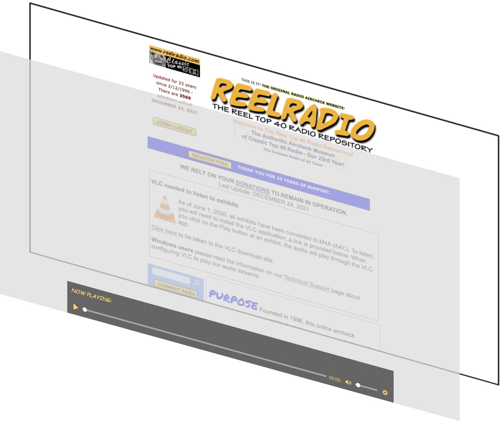

  
  <h3>User Manual</h3>
  <h4>Team Cloud Prime</h4>
  Zed Chance 
  Victor Galbraith 
  Nick Fairneny 
  Emmanuel Castrejon 
  Kobe Charles 
  Cesar Arroyo 

### Table of Contents

- [Introduction](#introduction)
- [Advanced Search Engine](#advanced-search-engine)
  - [Differences From “Find It!” Search](#differences-from-find-it-search)
  - [Where to Find the Advanced Search Page](#where-to-find-the-advanced-search-page)
  - [Performing a Search Query](#performing-a-search-query)
  - [Different Types of Results](#different-types-of-results)
    - [Transcription Results](#transcription-results)
    - [Scraped Text Results](#scraped-text-results)
    - [Exhibit Title Results](#exhibit-title-results)
- [Persistent Embedded Audio Player](#persistent-embedded-audio-player)
  - [Where to Find the Audio Player](#where-to-find-the-audio-player)
  - [Playing an Exhibit](#playing-an-exhibit)
  - [Controlling the Volume](#controlling-the-volume)
  - [Pausing and Resuming an Exhibit](#pausing-and-resuming-an-exhibit)
  - [Returning to the Currently Playing Exhibit](#returning-to-the-currently-playing-exhibit)

## Introduction

Team Cloud Prime, working together with Barry Brown and ReelRadio, have updated and modernized the long running and beloved aircheck site so that its behind the scenes features and operations have been changed or replaced, without disrupting the established user base’s experience.
In addition to a migration to a more efficient (both in cost and performance) server, new features were also seamlessly integrated into the existing site.
These include an easier to use, contemporary search engine and a perpetual audio player to replace the outdated VLC media player and make the site browsing experience more fluid.   

## Advanced Search Engine

If you are accustomed to the original search function, don’t worry!
It still works the same as it always did. 

### Differences From “Find It!” Search

The “Find It!” search, while consistent and functional, does not allow for searching for anything other than the exhibit (broadcast) titles themselves.
If the text you were looking for was not included in the title, it would not show up.
The new Advanced Search Engine allows for searching of titles as well as descriptions and transcripts.
It also implements full text indexing for a Natural Language Search.  

### Where to Find the Advanced Search Page

The process of performing a new search is easy and intuitive.
In order to use the new Advanced Search Engine, simply select the “Advanced Search” button on the home page, just below the original search bar.

### Performing a Search Query

After selecting “Advanced Search”, you will be taken to a new page where you can type in what you are searching for.
This can include names of DJ’s, collection names, locations, or other words that may have been spoken during your desired broadcast.
Once you do, hit the “Submit” button, and after the query matches the database your search results will appear.

### Different Types of Results

Interpreting the results is straightforward.
In the above example, we searched for “Los Angeles”.  This means the results displayed are connected to the term searched for, in a few different ways.  

#### Transcription Results

The first two results are transcription results.
This means that these words are spoken somewhere in the broadcast and obtained through audio transcription.
As a part of updating and adding some of the features to the site, a large number of broadcasts were transcribed to make an easier search experience for you, the user. 

#### Scraped Text Results

The next two results for Don Jennett and Micheal Hagerty are included because, according to their site biographies, they were both born in Los Angeles.
These types of results were obtained during a text-scraping process, where text from the site was recorded and “connected” to broadcasts which may be associated with it.  

#### Exhibit Title Results

The next result is a recorded broadcast from a Los Angeles radio station.
This one is more straightforward, as the search term is contained in the title of the exhibit (broadcast) itself.  

## Persistent Embedded Audio Player

There is no longer any need to download any other software, the AudioPlayer runs automatically as long as the user’s browser is able to run JavaScript.  
The “persistent” part of the audio player means that you can continue to browse ReelRadio.com and listen to your chosen broadcast at the same time.
The player will stay on the bottom of your screen while in use, and will maintain its functionality no matter where you choose to go on our site.  

### Where to Find the Audio Player

Using the AudioPlayer is simple.
First, you will need to navigate to `/ram/embedded_player.html` to access the new features offered.
From there simply login and click on the audio file as you normally do and the persistent player will appear. 

### Playing an Exhibit

As stated above, you simply need to select the exhibit you would like to play, and press the play button or use the link associated with it.
When you do, the player will appear automatically.
he controls are as follows: On the left there is a play/pause button.
n the center is a slider that allows you to seek a certain time.
To the right of the time slider is the time remaining.

### Controlling the Volume

To the right of that is the audio volume slider, slide to the right to increase volume and left to decrease. 

### Pausing and Resuming an Exhibit

In order to pause an exhibit, you simply need to press the pause button.
It will then change to a “play” triangular icon.
When you are ready to resume, press the play button and your playback will resume. 

### Returning to the Currently Playing Exhibit

If you want to return your browser to the exhibit page associated with the broadcast you are currently listening to, you can select the name of the exhibit on the player itself.
This will return you back to the page where you started to play the exhibit.  

